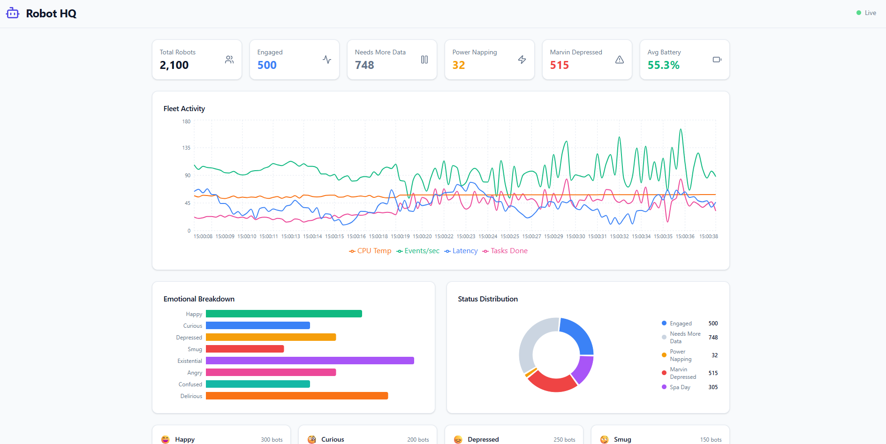

# Robot HQ - Real-Time Telemetry Dashboard



A centralized dashboard monitoring ~2,100 robots across 8 categories with real-time streaming telemetry.

## Quick Start

```bash
docker compose build
docker compose up
```

Open [http://localhost:5173](http://localhost:5173) in your browser.

## Architecture

| Layer | Technology |
|-------|-----------|
| Frontend | Vite + React + TypeScript + Tailwind CSS + Recharts |
| API | Go with Chi router |
| Real-time | Server-Sent Events (SSE) |
| Infrastructure | Docker Compose |

## API Endpoints

| Method | Path | Description |
|--------|------|-------------|
| GET | `/api/health` | Health check |
| GET | `/api/robots` | Paginated fleet snapshot |
| GET | `/api/robots/{id}` | Single robot detail |
| GET | `/api/categories` | Category summaries |
| SSE | `/api/stream/fleet` | Real-time fleet metrics (1s) |
| SSE | `/api/stream/category/{name}` | Per-category metrics (1s) |

## Development

Run services individually:

```bash
# API
cd api && go run .

# Frontend (in another terminal)
cd web && npm run dev
```

The Vite dev server proxies `/api/*` requests to `http://localhost:8080`.
